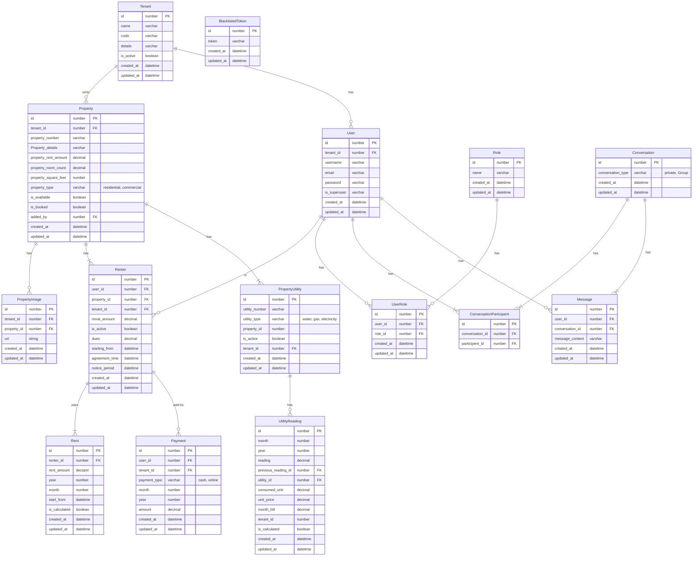
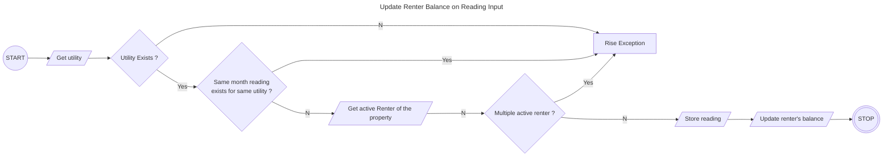
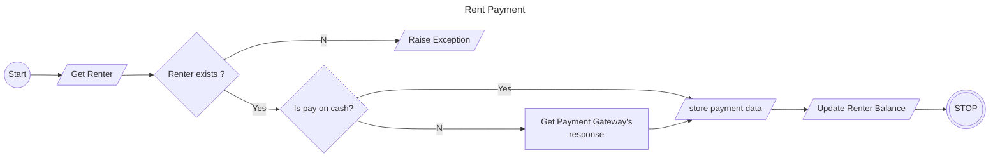

# Rent-Management-System

This is a comprehensive tool named “RMS” with an aim of maximizing rental income and minimizing administrative overhead.The system will be designed to help landlords manage their rental properties more efficiently and effectively.

## ER Diagram

## Activity Diagrams

